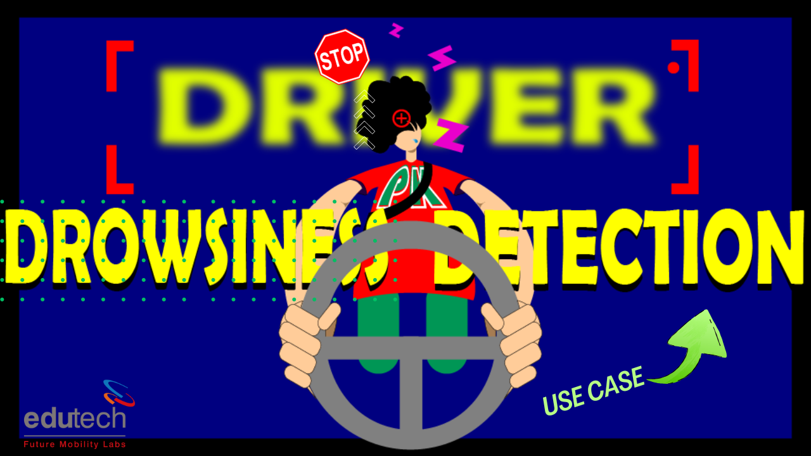

# Drowsiness Detection



This project implements a drowsiness detection system using Python, OpenCV, and Dlib. The system detects the drowsiness of a driver by monitoring their eye aspect ratio (EAR) and displays a warning message on the screen when drowsiness is detected.

## Features

- Real-time drowsiness detection using a webcam.
- Uses Dlib's pre-trained facial landmark predictor.
- Calculates the eye aspect ratio to detect drowsiness.
- Displays warning messages on the screen when drowsiness is detected.

## Code Explanation

For a detailed explanation of the code, see [Code Explanation](Code_Explanation.md)

## Requirements

- Python 3.x
- OpenCV
- Dlib
- Scipy
- Time

## Installation

1. Clone this repository to your local machine:

    ```bash
    https://github.com/prakash-kannaiah/Drowsiness_Detection.git
    cd drowsiness-detection
    ```

2. Create and activate a new Python virtual environment:

    ```bash
    python -m venv venv
    source venv/bin/activate   # On Windows: venv\Scripts\activate
    ```

3. Install the required packages:

    ```bash
    pip install -r requirements.txt
    ```

4. Download the facial landmark predictor model and place it in the `shape` directory:

    - [shape_predictor_68_face_landmarks.dat](http://dlib.net/files/shape_predictor_68_face_landmarks.dat.bz2)

5. Extract the `.bz2` file:

    On **Windows**:
    - **Using 7-Zip**:
      1. Right-click the `.bz2` file in File Explorer.
      2. Select `7-Zip` > `Extract to "shape_predictor_68_face_landmarks.dat\"`.

    - **Using WinRAR**:
      1. Right-click the `.bz2` file in File Explorer.
      2. Select `Extract Here` or `Extract to "shape_predictor_68_face_landmarks.dat\"`.

    Alternatively, you can use the following command in a command prompt if you have `bzip2` installed:
    ```bash
    bzip2 -d shape/shape_predictor_68_face_landmarks.dat.bz2
    ```
    **This will extract the file directly into the `shape` folder as `shape_predictor_68_face_landmarks.dat`.**

    If you don’t have `bzip2` installed, you can download it from the [GnuWin32 project](http://gnuwin32.sourceforge.net/packages/bzip2.htm) or use the GUI tools mentioned above.


## Project Structure

drowsiness-detection/
- shape/shape_predictor_68_face_landmarks.dat
- drowsiness_detection.py
- requirements.txt

## Usage

Run the drowsiness detection script:

```bash
python drowsiness_detection.py
```

## Contributing

We welcome contributions to improve this project! Here are some guidelines to get started:

1. **Fork the Repository**: Click on the "Fork" button at the top right of this repository page to create a copy of this repository under your GitHub account.

2. **Clone the Repository**: Use `git clone` to clone the forked repository to your local machine.
    ```bash
    git clone https://github.com/your-username/drowsiness-detection.git
    cd drowsiness-detection
    ```

3. **Create a New Branch**: Create a new branch for your feature or bugfix.
    ```bash
    git checkout -b my-new-feature
    ```

4. **Make Changes**: Make your changes to the codebase, ensuring you follow the existing code style and add appropriate tests if needed.

5. **Commit Your Changes**: Commit your changes with a meaningful commit message.
    ```bash
    git commit -m "Add a meaningful commit message here"
    ```

6. **Push to Your Fork**: Push your changes to your forked repository.
    ```bash
    git push origin my-new-feature
    ```

7. **Open a Pull Request**: Go to the original repository on GitHub and open a pull request with a clear description of your changes.

Thank you for contributing!

## License

This project is licensed under a custom license. You are free to use, copy, modify, and distribute the code and associated documentation, provided that you include the original copyright notice and adhere to the following condition:

- **Non-Commercial Use**: This project may not be sold or otherwise used for commercial purposes. Redistribution or use of this project for commercial purposes, including but not limited to selling or licensing, is not permitted.

For more details, please refer to the [LICENSE](LICENSE) file in this repository.

